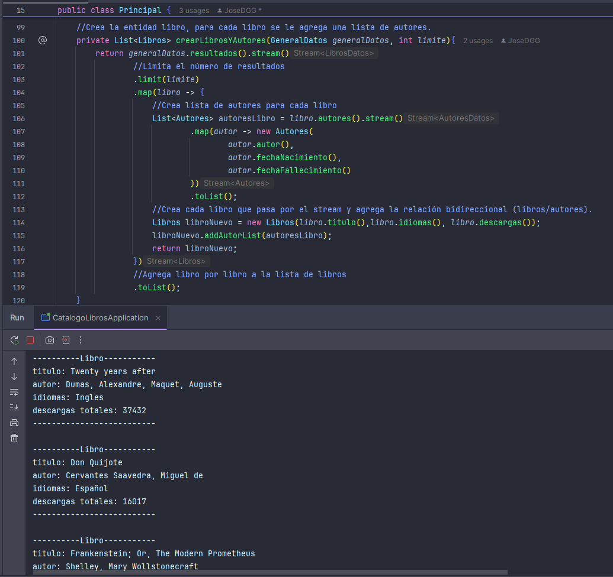
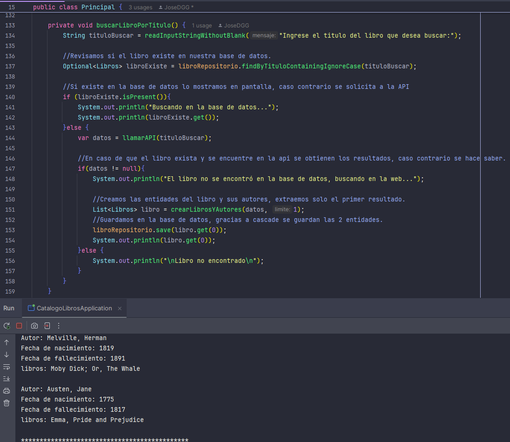
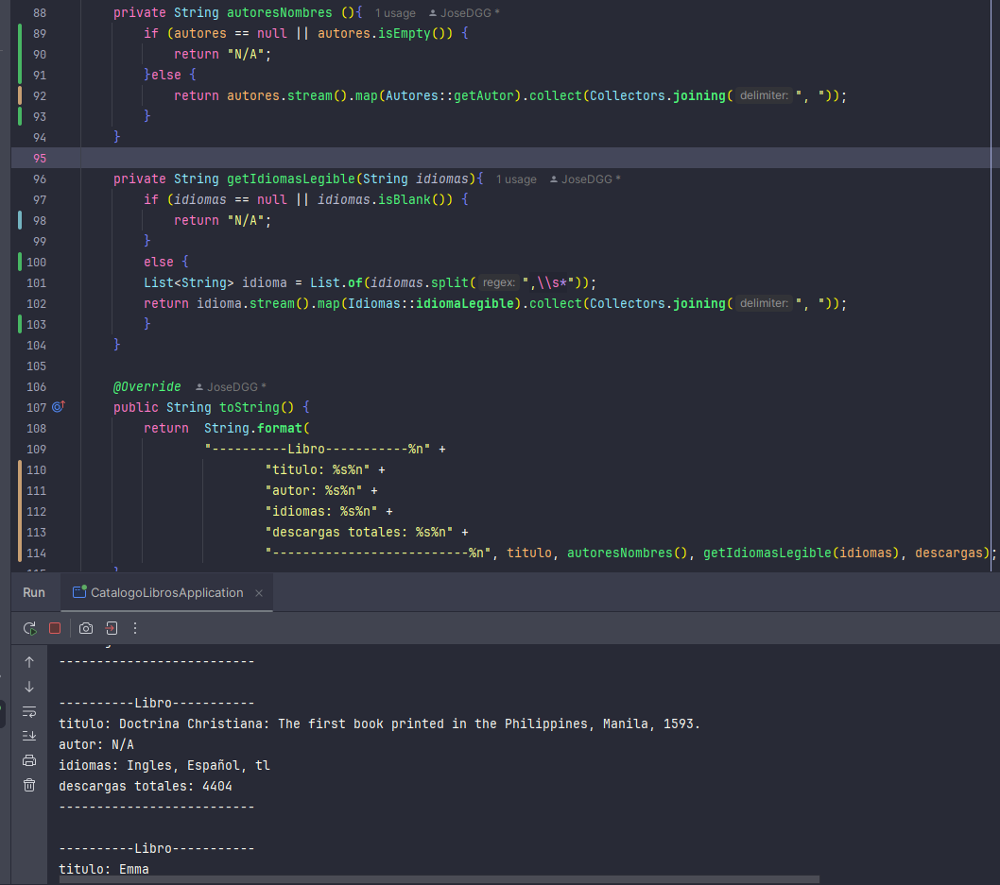

# Proyecto: LITERALURA con JPA y API

## Descripción
Este proyecto es un gesto de libros desarrollado en java que permite gestionar libros y autores utilizando **JPA** (Java Persistence API) para la gestión de datos en una base de datos relacional y consumir datos externos desde una API REST ( https://gutendex.com).

### Características principales:
- Consultar libros por título en una base de datos local o en la API.
- Registrar libros y sus autores, estableciendo relaciones bidireccionales.
- Listar libros registrados y autores con información detallada.
- Filtrar libros por idioma y obtener estadísticas sobre descargas.
- Obtener el top 10 de libros más populares.

---

## Tecnologías utilizadas

### Lenguaje y Frameworks
- **Java 17**
- **Spring Boot** para la configuración del proyecto y repositorios.
- **JPA** (Hibernate) para la persistencia de datos.

### Herramientas adicionales
- **Gutendex API** para consumir datos de libros.
- **Maven** como herramienta de gestión de dependencias.

---

## Configuración de la base de datos
El proyecto utiliza una base de datos relacional configurada con JPA. Asegúrate de incluir la configuración adecuada en el archivo `application.properties`:

```properties
spring.datasource.url=jdbc:mysql://localhost:8080/nombre_base_de_datos
spring.datasource.username=tu_usuario
spring.datasource.password=tu_contraseña
spring.datasource.driver-class-name=org.postgresql.Driver
hibernate.dialect=org.hibernate.dialect.HSQLDialect

spring.jpa.hibernate.ddl-auto=update

spring.jpa.show-sql=true
```

---

## Estructura del proyecto

### 1. **Entidades principales**
#### Clase `Libros`
- Representa los libros almacenados en la base de datos.
- Relación **Muchos a Muchos** con la clase `Autores`.
- Los idiomas de los libros se almacenan como una cadena separada por comas y se convierten a una lista legible.

```java
@Entity
@Table(name = "libros")
public class Libros {
    @Id
    @GeneratedValue(strategy = GenerationType.IDENTITY)
    private Long id;
    private String titulo;
    @Column
    private String idiomas;
    private int descargas;
    
    @ManyToMany(fetch = FetchType.EAGER, cascade = CascadeType.ALL)
    @JoinTable(
            name = "libros_autores",
            joinColumns = @JoinColumn(name = "libro_id", referencedColumnName = "id"),
            inverseJoinColumns = @JoinColumn(name = "autor_id", referencedColumnName = "id")
    )
    private List<Autores> autores = new ArrayList<>();
    
    // Métodos adicionales omitidos para brevedad
}
```

#### Clase `Autores`
- Representa los autores asociados a los libros.
- Relación **Muchos a Muchos** con la clase `Libros`.

```java
@Entity
@Table(name = "autores")
public class Autores {
    @Id
    @GeneratedValue(strategy = GenerationType.IDENTITY)
    private long id;
    private String nombre;
    private int fechaNacimiento;
    private int fechaFallecimiento;

    @ManyToMany(mappedBy = "autores", cascade = CascadeType.ALL, fetch = FetchType.EAGER)
    private List<Libros> libros = new ArrayList<>();
    
    // Métodos adicionales omitidos para brevedad
}
```

#### Enum `Idiomas`
- Enum para gestionar los códigos de idioma y su representación legible.

```java
public enum Idiomas {
    ES("Español"),
    EN("Inglés");

    private String idiomaLegible;

    public static String idiomaLegible(String texto) {
        for (Idiomas idioma : Idiomas.values()) {
            if (texto.equalsIgnoreCase(idioma.name())) {
                return idioma.idiomaLegible;
            }
        }
        return texto;
    }
}
```
#### FOTOS

- En esta foto se muestra el método con el que se crean los objetos de `libros` y `Autores` y
la ejecución del programa donde Twenty years after muestra 2 autores.
- En la consola se observa como se guardaron 2 autores para un mismo libro (Dumas Alexandre y Maquet Auguste).
- También se puede observar como los idiomas no son códigos de la API si no texto legible.



- En esta foto se muestra el método en el que se buscan libros por su titulo dependiendo si se encuentran en el repositorio o no
- En la consola se observa como se guardaron 2 libros para un mismo autor (Emma y Pride and Prejudice).



- En esta foto se muestra el método con el que se consigue pasar un `String` de códigos de idiomas guardados en la base de datos a un
String de idiomas legible para los usuarios sin afectar si el idioma aún no ha sido registrado.
- Para este caso la API no contiene autor por tanto se decidió dejar como N/A sin afectar las relaciones bidireccionales en la base de datos, aparecerá el libro registrado pero sin un autor al cuál haga referencia
  - Si se desea cambiar este comportamiento se debe mapear `nombre` de autor como `@Nonull` o lo pertinente.




### 2. **Clase Principal**
#### Clase `Principal`
La clase principal contiene el método `menu` para interactuar con el usuario mediante un menú en consola. Las opciones incluyen:

```java
private void mostrarMenu(){
    System.out.println("""
            *********************************************
            1.) - Buscar libro por titulo
            2.) - Ver libros registrados
            3.) - Ver autores registrados
            4.) - Ver autores vivos en un determinado año
            5.) - Listar libros por idioma
            6.) - Estadísticas sobre descargas de libros
            7.) - Top 10 libros más famosos
            8.) - Buscar por autor
            0.) - Salir de la aplicación
            *********************************************
            """);
}
```

Métodos importantes:
- **`buscarLibroPorTitulo()`**: Busca un libro en la base de datos o API y lo registra si no existe.
- **`crearLibrosYAutores(GeneralDatos generalDatos, int limite)`**: Crea entidades de libro y autor a partir de los datos de la API.

---

## Ejecución del proyecto
### Requisitos previos
1. **Java 17 o superior**
2. **Base de datos MySQL**
3. Configurar las dependencias de Maven en el archivo `pom.xml`:

- Spring Data JPA y PostgreSQL Driver (o base de datos de preferencia).
- **Jackson** Dependencia para convertir la información de JSON a clase java.
```xml
  <dependencies>
    <dependency>
        <groupId>org.postgresql</groupId>
        <artifactId>postgresql</artifactId>
        <scope>runtime</scope>
    </dependency>

    <dependency>
        <groupId>org.springframework.boot</groupId>
        <artifactId>spring-boot-starter-data-jpa</artifactId>
    </dependency>

    <dependency>
        <groupId>com.fasterxml.jackson.core</groupId>
        <artifactId>jackson-databind</artifactId>
        <version>2.16.0</version>
    </dependency>
</dependencies>
```

### Ejecución
1. Clona el repositorio.
2. Configura la base de datos en el archivo `application.properties`.
3. Ejecuta la clase `Principal` desde tu IDE o terminal.

---

## Futuras mejoras
- Soporte para más idiomas en el enum `Idiomas`.
- Mostrar los nombres por 'nombre y apellido' sin comas en vez de 'apellido, nombre'
- Relacionar una entidad existente de la base de datos con una nueva y guardar entidades.
